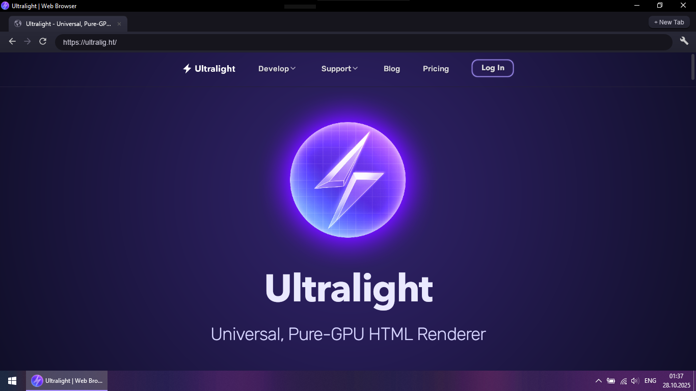

# Ultralight - Native Web Browser

[](https://github.com/ovsky/Ultralight-WebBrowser/actions/workflows/build-linux.yml)
[](https://github.com/ovsky/Ultralight-WebBrowser/actions/workflows/build-macos.yml)
[](https://github.com/ovsky/Ultralight-WebBrowser/actions/workflows/build-windows.yml)

> Ultra‑fast • Ultra‑light • Ultra‑portable


**Have you ever thought about a browser being just... a browser?**

No background services, no 2GB RAM usage for a single tab, no 5-second startup times?

Here it is: **Ultralight - Web Browser**!

---

This project is a fully open-source exploration of a de‑bloated, fastest‑possible browser.

It's a lightweight, native C++ web browser built with the [**Ultralight SDK**](https://ultralig.ht/) for all HTML/CSS/JS rendering. It is not a commercial product but a focused proof‑of‑concept demonstrating that high‑performance, low‑resource browsing is achievable today.



---

## 🚀 Why Ultralight? Ditch the Bloat.

Traditional web browsers and embedded frameworks (like Electron or CEF) are built on monolithic browser engines like Chromium. While powerful, they are designed as massive, sandboxed operating systems, bringing significant overhead in memory, CPU, and disk space.


This browser takes a different approach by using **Ultralight**, a next-generation HTML renderer designed from the ground up for speed, efficiency, and seamless integration into native apps.

**Here’s how it compares to the status quo:**

---

## 🎯 Project Philosophy & Goals

This repository serves as a practical, open-source example for developers. The primary goals and features are:

| **Feature** | **Ultralight (This Browser)** | **Electron / CEF**  |
|-- |--|--|
| **Performance** |  **Up to 6x faster** | Standard Chromium |
| **Memory Usage** | **~1/10th the RAM** | High (Full browser instance) |
| **Startup Time** | Near-instant (<1 sec) | Noticeable delay (3+ sec) |
| **Storage** | ~30 MB footprint | ~1000+ MB footprint |
| **Rendering** | GPU-accelerated, lightweight | GPU-accelerated, heavyweight |
| **Architecture** | Native C++, renders to a pixel buffer | JS Bridge + Node.js + Chromium |


By leveraging Ultralight's high-performance, GPU-accelerated renderer, this application achieves a level of resource efficiency that is simply not possible with other frameworks. It's designed to be a component, not an OS.

## 📥 Get the App

### You can download the latest <b>official versions</b> from releases.

<b>DOWNLOAD:</b>

[**Ultralight Web Browser - Releases**](https://github.com/ovsky/Ultralight-WebBrowser/releases)

ㅤ
---

You can also download prebuilt development packages from GitHub Actions Artifacts on the latest successful run:

- Windows: ultralight-windows.zip (portable)
- macOS: ultralight-macos-packages (TGZ or DMG)
- Linux: ultralight-linux-packages (TGZ, DEB, RPM)

Tip: Open the Actions tab, filter by your platform workflow (Build - Windows/Linux/macOS), open the latest green run, then scroll to “Artifacts”.

### Quick links to latest builds

| Platform | Packages produced | Latest run (dev) |
|---|---|---|
| Linux | TGZ, DEB, RPM | [Open runs](https://github.com/ovsky/Ultralight-WebBrowser/actions/workflows/build-linux.yml?query=branch%3Adev) |
| macOS | TGZ, DMG | [Open runs](https://github.com/ovsky/Ultralight-WebBrowser/actions/workflows/build-macos.yml?query=branch%3Adev) |
| Windows | ZIP (portable) | [Open runs](https://github.com/ovsky/Ultralight-WebBrowser/actions/workflows/build-windows.yml?query=branch%3Adev) |

Note: GitHub Actions artifacts are attached per-run. Click “Open runs,” select the latest successful run, then download the artifact(s) listed at the bottom.

### Install on Windows
- Download ultralight-windows.zip and extract.
- Run `Ultralight-WebBrowser.exe`.

### Install on macOS
- TGZ: extract and run `Ultralight-WebBrowser` in the extracted folder.
- DMG: mount and drag the folder to Applications (or any location), then run `Ultralight-WebBrowser`.

### Install on Linux
- DEB (Debian/Ubuntu):
    ```bash
    sudo apt install ./Ultralight-WebBrowser-*.deb
    ultralight-webbrowser
    ```
- RPM (Fedora/RHEL/openSUSE):
    ```bash
    sudo dnf install Ultralight-WebBrowser-*.rpm
    ultralight-webbrowser
    ```
- TGZ (portable, no root):
    ```bash
    tar -C "$HOME/.local/opt" -xzf Ultralight-WebBrowser-*.tar.gz
    "$HOME/.local/opt/UltralightWebBrowser/Ultralight-WebBrowser"
    ```

Linux packages install a desktop entry and icon (Application Menu → Ultralight Web Browser) and a CLI launcher `ultralight-webbrowser`.

---

## ✨ Features

-   **Blazing Fast Rendering:** Thanks to the Ultralight core, pages load and respond quickly.

-   **Extremely Low Memory Footprint:** Browse more without your system grinding to a halt.

-   **Modern Web Support:** Renders HTML5, CSS3, and modern JavaScript (ES6+).

-   **Native C++ Core:** No JavaScript bridge, no Node.js backend. Just pure native speed for the UI and app logic.

-   **Core Browser UI:**

    -   Multi-tab interface

    -   Address bar with navigation (Go, Back, Forward, Reload)

    -   Loading indicators and page title display

    -   Responsive window resizing

-   **Ad/Tracker Blocking (lightweight):**

        - Domain-based rules, URL substrings, and simple wildcard patterns.
        - Default rules in `assets/blocklist.txt` plus extra lists under `assets/filters/` (all `.txt` files are loaded).
        - Supported formats per line:
            - `example.com` (blocks domain + subdomains)
            - `0.0.0.0 example.com` (hosts-style)
            - `||example.com^` (adblock-style domain rule)
            - `/ads.js` (simple URL substring)
            - `*://*/*analytics*.js` (simple glob; `*` and `?` supported)
        - Notes:
            - Local `file://` and `data:` URLs are always allowed.
            - Network interception depends on SDK capabilities. If your Ultralight build does not expose network interception, rules may be ignored at runtime.


## 🛠️ Tech Stack

-   **Core Renderer:** [Ultralight SDK](https://ultralig.ht/ "null")

-   **Language:** C++17

-   **Windowing & Input:** [GLFW](https://www.glfw.org/ "null")

-   **Graphics:** OpenGL 3.3

-   **Build System:** CMake


## 🧑‍� Build from source

### Prerequisites

1.  **CMake** (3.10 or higher)

2.  A C++17 compliant compiler (e.g., Visual Studio 2019+, GCC 9+, Clang 9+)

3.  **Ultralight SDK (optional):**

    The sample ships with a working SDK under `data/`, so you can build out‑of‑the‑box.

    To use a different SDK, set the CMake cache variable `ULTRALIGHT_SDK_ROOT` during configure to the SDK root (it must contain `include/`, `lib/`, `bin/`).


### Build steps

```bash
# 1. Clone the repository
git clone https://github.com/ovsky/Ultralight-WebBrowser.git
cd Ultralight-WebBrowser

# 2. (Optional) Initialize submodules if needed
git submodule update --init --recursive

# 3. Configure
cmake -S . -B build \
    -DULTRALIGHT_SDK_ROOT="/absolute/path/to/ultralight-sdk"   # optional override

# 4. Build
# On Windows (MSVC multi-config)
cmake --build build --config Release

# On macOS/Linux (single-config)
cmake --build build --parallel
```

On Windows you can also use the helper scripts:

```powershell
./build.bat    # configure + build (Release)
./run.bat      # run the app from build\Release
```

The final executable is typically in `build/Release/` (Windows multi‑config) or `build/` (Unix Makefiles/Ninja).

## 🧩 JavaScript Bridge API (window.__ul)

Pages can call native functionality via a minimal JS bridge exposed on the main page frame as `window.__ul`.

Available methods:

- Navigation and tabs:
    - `__ul.back()` / `__ul.forward()` / `__ul.reload()` / `__ul.stop()`
    - `__ul.navigate(url)` – navigate current tab to `url`
    - `__ul.newTab([url])` – open a new tab (optionally at `url`)
    - `__ul.closeTab([id])` – close current tab or a specific tab by id
    - `__ul.openHistory()` – open built‑in History page in current tab

- History:
    - `__ul.getHistory()` → `{ items: [{ url, title, time }, ...] }`
    - `__ul.clearHistory()` – clear in‑memory history

- Dark theme:
    - `__ul.toggleDarkMode()` – toggle auto dark mode for all tabs
    - `__ul.isDarkModeEnabled()` → `boolean`

- App info:
    - `__ul.getAppInfo()` → `{ name, version }`

Example:

```js
// Open a link in a new tab
__ul.newTab('https://example.com');

// Toggle dark mode from page JS
if (!__ul.isDarkModeEnabled()) __ul.toggleDarkMode();

// Render a simple history list
const h = __ul.getHistory();
for (const item of h.items) console.log(item.time, item.title, item.url);
```

Notes:

- The bridge is injected on DOM ready for the main frame of each page. Subframes don’t receive it.
- The History API reflects an in‑memory list. It is not persisted across launches.
- Methods are no‑ops if the underlying native state is unavailable.

### Create packages locally (optional)
We ship CPack rules for self‑contained packages:

```bash
cmake -S . -B build -DCMAKE_BUILD_TYPE=Release
cmake --build build --parallel

# Linux: any of TGZ / DEB / RPM
cpack --config build/CPackConfig.cmake -C Release -G TGZ
cpack --config build/CPackConfig.cmake -C Release -G DEB
cpack --config build/CPackConfig.cmake -C Release -G RPM

# macOS: TGZ (and DMG if enabled in workflow input)
cpack --config build/CPackConfig.cmake -C Release -G TGZ
```

## 🗺️ Roadmap / Ideas

This is a proof-of-concept, but there's plenty of room for improvement. Pull requests are welcome!

-   [x] Flexible Context Menu

-   [x] Local Browsing History

-   [x] Optimized Ad-blocking and Tracking Blocking System

-   [x] Universal Menu

-   [x] Shortcut Map System

-   [x] Dark Theme [WIP]

 -  [x] Deeper integration with Ultralight's JS C++ bridge (expose native functions to JS)

 -  [x] Favicon Support

 -  [ ] Autosuggestion / Autocompletion 

-   [ ] Bookmark System

-   [ ] Downloads

-   [ ] Plugins Support (Scripts?)

-   [ ] Improved UI/UX (a settings panel, right-click context menus)


## 🤝 Contributing

Contributions are what make the open-source community such an amazing place. Any contributions you make are **greatly appreciated**.

1.  Fork the Project

2.  Create your Feature Branch (`git checkout -b feature/some-feature`)

3.  Commit your Changes (`git commit -m 'Add some feature'`)

4.  Push to the Branch (`git push origin feature/some-feature`)

5.  Open a Pull Request


## 📄 License

Distributed under the MIT License. See `LICENSE` for more information.

## 🙏 Acknowledgements

-   This project would be impossible without the incredible work of the [Ultralight](https://ultralig.ht/ "null") ❤ team.

-   [GLFW](https://www.glfw.org/ "null") for simple, cross-platform windowing and input.
